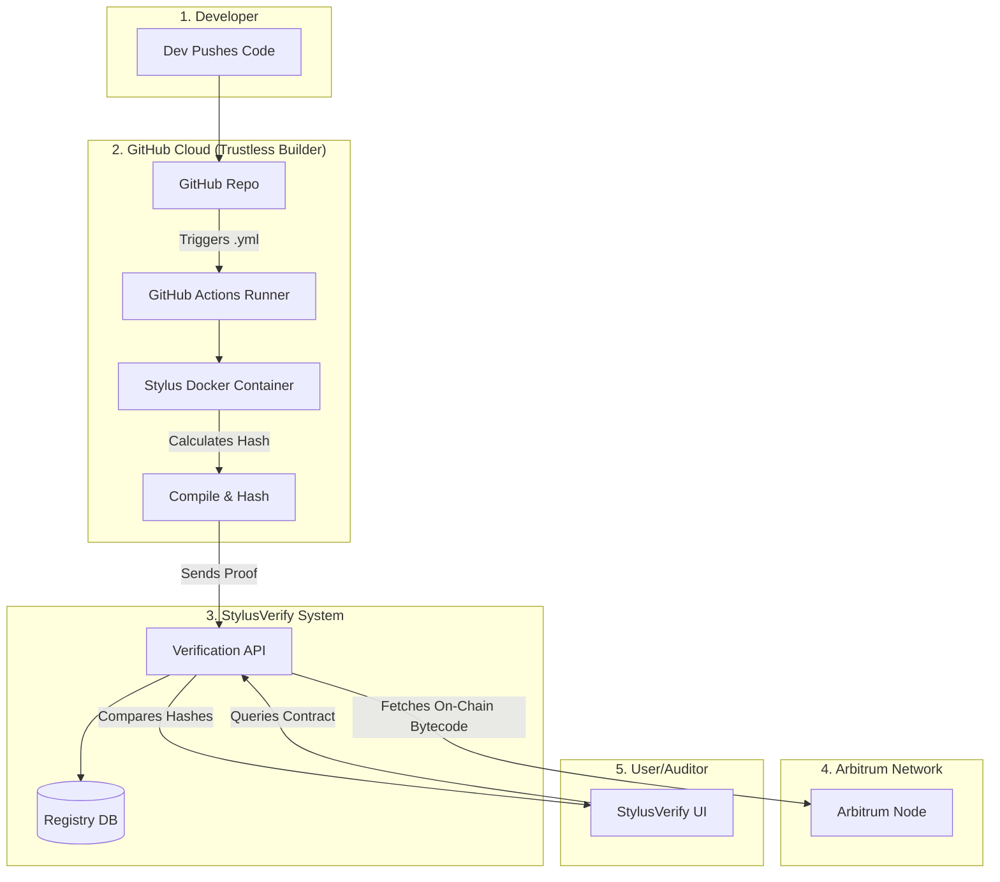

# StylusVerify 🛡️

**Deterministic source verification interface for Arbitrum Stylus (Rust/WASM) contracts.**

## 📖 Overview

**StylusVerify** is a tooling infrastructure designed to solve the "Reproducible Build" problem in the Arbitrum Stylus ecosystem.

In the WASM-based blockchain world, verifying that the on-chain bytecode matches the GitHub source code is critical. StylusVerify provides a decentralized architecture to prove this integrity using standard Docker environments and CI pipelines.

> **Note:** This repository currently hosts the **"Wizard of Oz" MVP (Proof of Concept)**. It demonstrates the user experience and verification flow. The backend integration with GitHub Actions is in the roadmap.

## 🔗 Live Demo

Try the active simulation here:

## 🏗 Architecture (The Vision)

StylusVerify utilizes a **Decentralized CI Verification** model. Instead of relying on a centralized proprietary server, it leverages GitHub Actions to compile contracts in a trustless, isolated Docker container.

## 🚀 Features
- Engineering-First UI: Dark mode, terminal-style logs, and technical aesthetics designed for developers.

- WASM Integrity Check: Simulates the verification of Rust source code against on-chain WASM bytecode.

- Visual Feedback: Detailed step-by-step logging of the compilation and hashing process.

- Simulation Mode: Includes a "Wizard of Oz" simulation engine for demonstration purposes.

## 🛠 Tech Stack
- Framework: Next.js 14 (App Router)

- Styling: Tailwind CSS

- Icons: Lucide React

- Animations: Framer Motion

- Language: TypeScript

## 🧪 How to Test (Demo Data)
Since this is a simulation MVP, use the "Golden Path" data to see the success state:

Click the "Load Demo Data" button on the UI.

Repo: https://github.com/arbitrum-dev/stylus-hello-world

Address: 0x1234567890123456789012345678901234567890

Click "Verify Integrity".

To see the error state, simply change the address to any other random string.

## 🗺 Roadmap
[x] Phase 1: Interface & UX Design (MVP) - Completed

[ ] Phase 2: Decentralized CI Script - In Progress

Creating the standard .yml workflow for GitHub Actions.

[ ] Phase 3: Backend API Integration

Connecting the frontend to a real database to store verification proofs.

[ ] Phase 4: Mainnet Launch

Deploying the verification registry on Arbitrum One.

## 🤝 Contributing
Contributions are welcome! Please click star button!

## 📄 License
This project is licensed under the MIT License.
